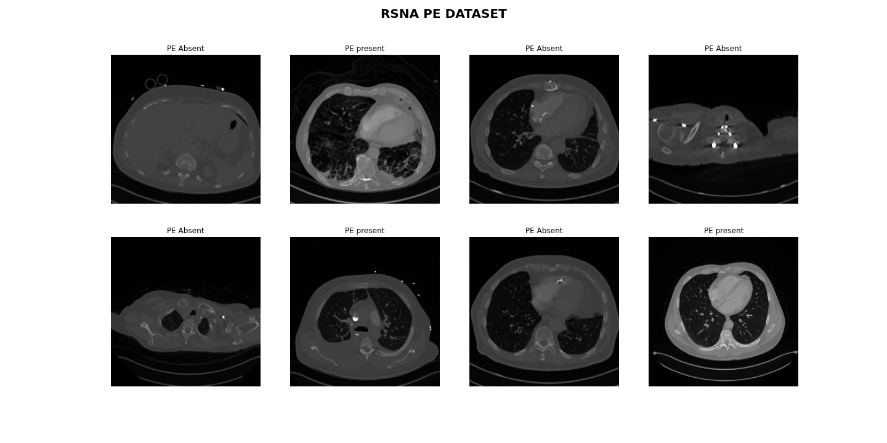
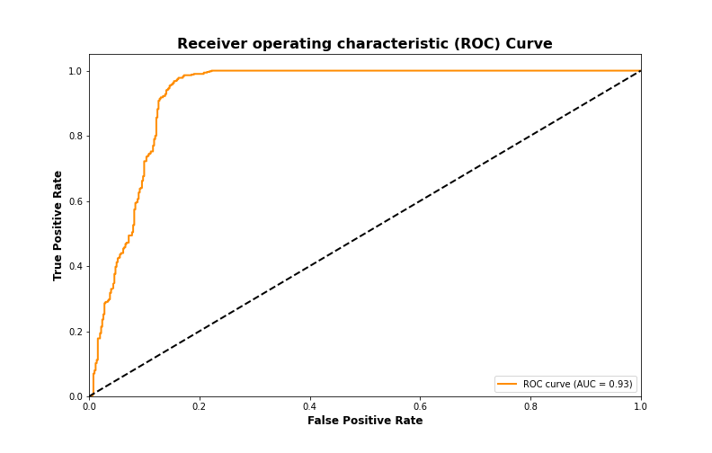

# Pulmonary Embolism Classification with Swin Transformer

## Overview
This repository contains the code for classifying Pulmonary Embolism (PE) in CT scans using the state-of-the-art Swin Transformer model. The project includes Jupyter notebooks, data pipelines, and images necessary for training and evaluating the model.

## Contents

- `notebooks/`: Jupyter notebooks for data exploration, model training, and evaluation.
- `data/`: Scripts and modules for data preprocessing and augmentation.
- `images/`: Sample images and visualizations used in the notebooks.
- `requirements.txt`: Dependencies required to run the code.

## Getting Started

1. **Clone the Repository:**
   ```bash
   git clone https://github.com/your-username/PE-CT-Classification-SwinTransformer.git
   cd PE-CT-Classification-SwinTransformer
   ```

2. **Install Dependencies:**
   ```bash
   pip install -r requirements.txt
   ```

3. **Data Preparation:**
   - Place your RSNA CT scan data in a folder named `dataset/`.
   - Follow the instructions in the `data/` directory for preprocessing.

4. **Notebooks:**
   - Explore the `notebooks/` directory for Jupyter notebooks covering data analysis, model training, and evaluation.

5. **Model Training:**
   - Execute the notebook `training.ipynb` to train the Swin Transformer on your PE dataset.

6. **Evaluation:**
   - Evaluate the model using the `training.ipynb` notebook.


## Data-visualization
### Sample CT Scan Image


*Caption: A sample CT scan image from the dataset.*

## Result


*Caption: Training Loss.*


*Caption: ROC curve and AUC Score.*

## Acknowledgments

- The Swin Transformer model implementation is based on the official repository: [Swin Transformer](https://github.com/microsoft/Swin-Transformer).
- This project utilizes the PyTorch implementation of Swin Transformer:  [Swin Transformer](https://github.com/pytorch/vision/blob/main/torchvision/models/swin_transformer.py).

## Dataset Citation

If you share or re-distribute the data used in this project, please include a citation to the “RSNA-STR Pulmonary Embolism CT (RSPECT) Dataset, Copyright RSNA, 2020” as follows:

> E Colak, FC Kitamura, SB Hobbs, et al. The RSNA Pulmonary Embolism CT Dataset [https://pubs.rsna.org/doi/full/10.1148/ryai.2021200254]. Radiology: Artificial Intelligence 2021;3:2.

This dataset is a valuable resource, and proper acknowledgment helps support the work of the original authors and the RSNA community.

## License

This project is licensed under the MIT License - see the [LICENSE](LICENSE) file for details.
